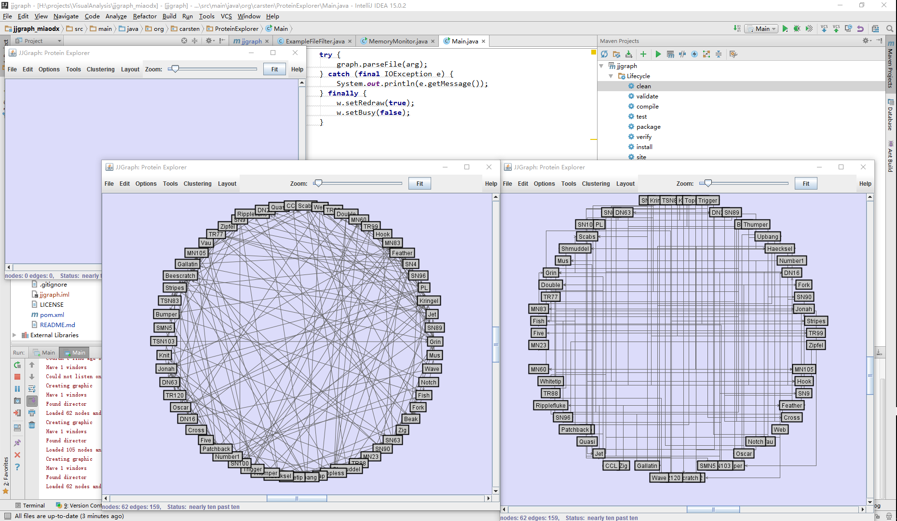

# jjgraph, a rather old graph drawing and algorithm library.

There are probably better ones out there these days, but it may contain some useful algorithms or approaches not covered anywhere else.

(c) Carsten Friedrich with contributions by Falk Schreiber, Francois Bertault, Damian Merrick, and others

## 
This pic is produced by the software with `gml/dolphins.gml` and change the layout by `Cicular layout` and `Cicular layout + Orthogonal`.(Seems nice,right?)

To make a quick start, you can just load files in `gml` dictionary and play with different algorithms and layouts.

And if you're a windows user, chances are that the codes will not run so smoothly, see [`windows_helper.md`](windows_helper.md) for more info.


### Reference

There is an old paper seems highly relevant with this software [The Metro Map Layout Problem](http://link.springer.com/chapter/10.1007%2F978-3-540-31843-9_50) :
```
@inproceedings{hong2004metro,
  title={The metro map layout problem},
  author={Hong, Seok-Hee and Merrick, Damian and Do Nascimento, Hugo AD},
  booktitle={International Symposium on Graph Drawing},
  pages={482--491},
  year={2004},
  organization={Springer}
}
```